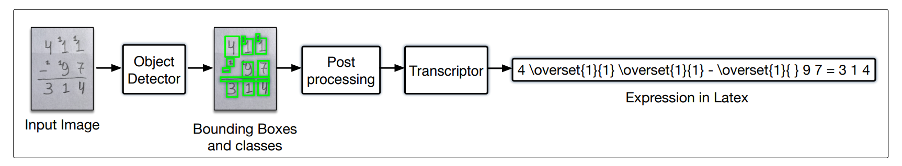

# HME-VAS: Handwritten Mathematical Expression - Vertical Addition and Subtraction
This repository is the official implementation of [Recognizing Handwritten Mathematical Expressions of Vertical Addition and Subtraction]

<b>Authors</b>: Daniel C. Rosa, Filipe R. Cordeiro, Ruan Carvalho, Everton Souza, Luiz Rodrigues, Marcelo Marinho, Thales Vieira and Valmir Macario.

<b>Illustration</b>\


## Requirements
- This codebase is written for `python3`.
- To install necessary python packages, run `pip install -r requirements.txt`.

## The Dataset:
The dataset used in the paper is available in this repository. The images folder
contain 300 images of vertical equations, while the labels folder contains the
annotations files written on YOLO format.

The `classes.txt` contains the labels used on the paper. It contains the numerical
symbols, from 0 to 9, the addition and subtraction symbols, the equals symbol and
the overset symbol, "c1".

The `labels.csv` file contains the transcription from all 300 images. It also
highlights which annotator was used to write the equation. (This file is going
to be added soon)

## The Augmentation Data Generator:
The `augmentation` folder contains a script that creates new binarized images
of vertical equations. As it is said on the paper, it can be used to improve
the results of the object detection training. The equations generated are not
meant to have logical equations. It only intends to generate random equations,
with random values, but with the pre-setted positions of a common vertical
equation. It uses the numerical symbols from MNIST dataset and uses the addition,
subtraction and equals symbols from our proposed dataset. The MNIST digits
were taken from this link: [Kaggle_MNIST](https://www.kaggle.com/datasets/oddrationale/mnist-in-csv).

## The Code:
The code is divided in two steps, which are the following:

1. Detection Step:
This step is going to be used to detect the mathematical symbols of the images.

2. Translation Step:
This step is going to take the bounding boxes from step 1 and do the transcription.

On `example.ipynb` notebook, we are making available an example that
uses both steps mentioned above to make the HMER process. The model used in this example
is the same model used in our paper, which was the best model in our research:
the YOLO V8 model, tested with the H3 annotator.

<b>Cite HME-VAS</b>\
If you find the code useful in your research, please consider citing our paper:

```
It is going to be added in the future.
```
## Contact
Please contact daniel.carneiro@ufrpe.br if you have any question on the codes.